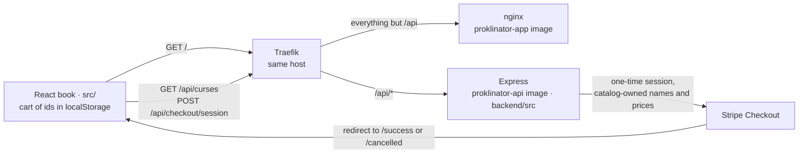
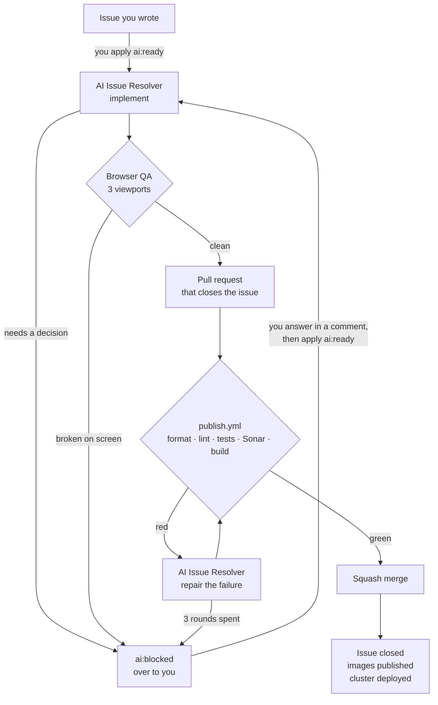

# Proklinator

**A book of curses that you turn, and an agent that does the work.**

The catalogue is presented as a real book: a two-page spread, bookmarks along the fore
edge, and page turns that actually rotate a leaf. Every curse is its own short
multi-page chapter - a legend, an origin, the objects and their symbolism, alleged
accounts, a modern investigation, an occasional note from the machine, and a closing
choice. Choosing an option circles it in marker and drops it onto the order sheet, where
a one-time Stripe checkout sends it to the AI. The interface is localised into English
and Russian, switchable from the header; everything else here, code and comments
included, is English.

## Features

- Six chapters, each with its own frontispiece; every curse opens on a fresh page and
  runs as a short multi-page chapter of its own
- Automatic composition: whatever does not fit a page is carried to the next one
- Page turns with a three-dimensional leaf rotation and the sound of paper
- Bookmarks on the fore edge: chapters behind you on the left, the ones ahead on the right
- Creased corners hinting that there is another page
- Option selection circled in marker; the cart survives a reload
- An order sheet with the total and a one-time Stripe checkout

## Stack

- React 19
- Vite 8
- Tailwind CSS 4 — CSS-first, no config file; theme tokens live in the `@theme` block of `src/index.css`
- ESLint 10 + Prettier 3
- Vitest 5 — jsdom for the site, node for the API
- nginx 1.31-alpine runtime image
- Express 5 on Node 24 for the API in `backend/`

## How it fits together

Two images run side by side on one host, so the browser only ever speaks to one origin and
there is no CORS to configure. Traefik sends `PathPrefix(/api)` to the Express pod and
everything else to nginx. The prefix is not stripped, which is why the routes in
`backend/src/app.js` are declared with `/api` already on them:



The browser only ever sends selected ids; `backend/src/catalog.js` is the single source of
the names, prices and currency that reach Stripe. Both images are built from the same
commit and carry the same 7-character tag, so the site and its API always move together.

## How the book is laid out

Pages do not scroll on a spread. `src/components/organisms/MeasureLayer.jsx` renders every content
block once, off-screen, at the exact size of a real page; `src/lib/pagination.js` then packs
those measured heights into pages and pairs the pages into spreads. A chapter always opens
on a left-hand page, so the bookmarks line up with the spread they name. A curse is one
more level of the same composition: its first section opens on a fresh page, and the
sections after it flow, carrying over when they do not fit, until the closing price list.

Two consequences worth knowing before editing:

- The gap between blocks lives in `.page-blocks > * + *` in `src/index.css`. Change it there
  and mirror it in `blockGap()` in `src/App.jsx`, or pagination will misjudge what fits.
- Page typography is sized in `rem` and the root size follows the viewport height, so the
  whole book scales as one. Absolute `px` in page content breaks that.

## Payments

Prices are backend-owned. `src/lib/useCatalog.js` fetches `GET /api/curses`, and every
price on the price lists, the order sheet and the title page is read from that response —
the frontend data carries only presentation, keyed by the same stable ids. A row whose id
is missing from the catalog (while it loads, or because it vanished) shows an em dash and
cannot be chosen, so the client never invents a price.

The cart lives in `localStorage` as a list of `{ curseId, optionId }` pairs — ids only,
never prices or names. One option per curse, mirroring the book's radio behaviour:
choosing another option of the same curse replaces the first, and clicking the selected
one removes it, so a curse+option can never appear twice.

`src/lib/checkout.js` posts those ids to `VITE_CHECKOUT_URL` (default
`/api/checkout/session`), and the backend validates every pair against its catalog,
resolves the backend-owned names, prices and currency, and creates a one-time Stripe
Checkout Session whose `url` the browser is redirected to. Stripe redirects to
`/success` after a confirmed payment — a theatrical "the curse is being prepared"
sequence of roughly thirty seconds that varies with the selected curse, then the
confirmation page that clears the cart. A cancelled or abandoned checkout lands on
`/cancelled`, the interrupted-rite page: the payment status is stated plainly and the
cart is left untouched so retrying starts from the same order sheet.

## The API

`backend/` is an Express app served at `/api`, deployed beside the site rather than behind
it: Traefik matches `PathPrefix(/api)` on the same host and sends those requests to the API
pod, everything else to nginx. Same origin, so there is no CORS to configure, and the
prefix is not stripped — routes in `backend/src/app.js` are declared with `/api` on them.

`app.js` builds the Express app and holds every route; `config.js` reads the environment;
`server.js` constructs the Stripe client and listens. The split exists so the routes — and
the configuration that decides which Stripe client they get — can be tested: with
`listen()` at module scope, importing the API bound a port and demanded its configuration,
and nothing that decides what a buyer is charged could be reached by a test.

`GET /api/health` returns the short SHA of the commit the image was built from, which is
also its tag. That is the quickest way to tell whether a deploy actually landed. It also
reports whether Stripe credentials reached the process — `"stripe": "configured"` or
`"missing"` — never the keys themselves, or any prefix of them.

`GET /api/curses` returns the commerce catalog: a hardcoded in-memory list of curses and
their one-time options, each with a stable id, a backend-owned name, an integer
`unitAmount` in the smallest currency unit and a currency. The catalog is the source of
truth for everything Stripe-facing; the frontend maps its own presentation onto these
ids.

`POST /api/checkout/session` takes `{ items: [{ curseId, optionId }] }` — ids only — and
creates a one-time Stripe Checkout Session. Every item is validated against the catalog
and every line item is named `{Curse Name} — {Option Name}` from backend-owned names.
`success_url` is `/success` on the caller's origin and `cancel_url` is `/cancelled`; both
are built from the request's `Origin` header, the one thing the API pod cannot know about
itself. Without Stripe keys the route answers `503` and the app says payments are
temporarily unavailable.

### Configuration

The API takes its configuration from the environment in `backend/src/config.js`. Nothing
is read from a file and nothing is baked into the image; a build arg would end up in the
layer history of a public image.

| Variable                 | What it is                                    |
| :----------------------- | :-------------------------------------------- |
| `PORT`                   | Listen port. Defaults to `3000`.              |
| `GIT_SHA`                | Build-time commit, reported by `/api/health`. |
| `STRIPE_SECRET_KEY`      | Stripe secret key. Server-side only, ever.    |
| `STRIPE_PUBLISHABLE_KEY` | Stripe publishable key.                       |

The two Stripe names are identical everywhere and only the **value** changes:

- **In the cluster** they come from the Vault secret `proklinator-secrets` (properties
  `stripe-api-secret-key` and `stripe-api-publishable-key`), pulled in by the External
  Secrets Operator and mounted as environment variables. Live keys.
- **In CI** they are the `STRIPE_TEST_SECRET_KEY` and `STRIPE_TEST_PUBLISHABLE_KEY`
  repository secrets, mapped onto these names in the workflow environment. Test keys, so
  the agents can build and exercise checkout without touching real money.
- **Locally** they are whatever you export.

Nothing in `backend/` branches on which environment it is running in. Code that switches on
`NODE_ENV` to pick a key is code that can pick the wrong one.

Run it locally with test keys:

```bash
cd backend
STRIPE_SECRET_KEY=sk_test_... STRIPE_PUBLISHABLE_KEY=pk_test_... npm run dev
curl -s localhost:3000/api/health
```

## Development

```bash
npm install
npm run dev
```

The API is a separate package with its own dependencies:

```bash
cd backend
npm install
npm run dev
```

The dev server proxies `/api` to the backend, so the app and the API share an
origin exactly like production. The target defaults to `http://localhost:3000`;
point it at a backend elsewhere with a local override:

```bash
echo 'API_PROXY_TARGET=http://localhost:4000' > .env.local
```

`.env.local` is git-ignored; `.env.example` lists the variable.

## Tests

Two suites, because the site and the API are two packages with their own lockfiles, their
own images and their own SonarCloud project. Each writes its own coverage report.

```bash
npm run test:site   # vitest, jsdom, src/        -> coverage/site/lcov.info
npm run test:api    # vitest, node, backend/src/ -> coverage/api/lcov.info
npm test            # both
```

`test:api` needs the API's dependencies — `npm ci --prefix backend` — because it imports
`backend/src`, which resolves `express` and `stripe` from `backend/node_modules`.

Coverage thresholds live in `vitest.site.config.js` and `vitest.api.config.js`, not in a
CI step, so `npm test` alone enforces them. `backend/src/app.js` is held at 100%: every
route there decides what a buyer is charged. `backend/src/server.js` reads 0% in the
report on purpose — it binds a port at module scope, so v8 cannot instrument it, and
`test/api/server.test.js` spawns it as a real process instead. It is left in the report
rather than excluded, because an exclusion is the same move as lowering a threshold.

## Before you commit

Run the whole gate. All of it is blocking in CI:

```bash
npm run format:check   # Prettier
npm run lint           # ESLint
npm run test:site
npm run test:api
npm run build
```

If `format:check` complains, fix it with `npm run format`; `npm run lint:fix` clears most
lint findings.

Do not reformat `.github/` — it is listed in `.prettierignore` because all three workflows
there are generated by `homelab-infra` and overwritten on every apply. Edit them there,
not here.

## CI/CD

`publish.yml` is this repository's CI, the check on every pull request, and its deploy
trigger. Four stages:

1. **Verify** — install both lockfiles, `format:check`, `lint`, both test suites, the
   production build, then SonarCloud on the site and on the API with the quality gate
   waited on. Every one of these blocks.
2. **Build** — `proklinator-app` (site) and `proklinator-api`, from the same commit, in
   parallel. Built on every trigger so a pull request exercises both Dockerfiles; pushed
   to GHCR only from `main`.
3. **Scan** — syft builds an SBOM of each published image and grype scans that SBOM, by
   digest. Report only: it never blocks, because a base image carries findings nobody
   upstream has packaged a fix for. Read it in the run summary.
4. **Deploy** — the cluster is told to roll out the new tag.

Both images carry the same 7-character commit SHA and the cluster is bumped only after
both have been pushed, so the site and its API always move together. Adding a third image
means adding it to `homelab-infra`'s `apps` list as well, or its Deployment will quietly
stay on an older tag.

Pull requests run stages 1 and 2 only; nothing is published or deployed until merge.

`main` is the production branch.

## Handing work to the agents

Two agents run on this repository, and they never touch the same branch. **Dependency
pull requests** from bots are swept, repaired and merged every morning by
`ai-pr-agent.yml`. **Everything else** starts as an issue you label.



The only two boxes you touch are the first and, if it gets there, `ai:blocked`.

### Creating a task

1. **Open an issue** describing what you want.
2. **Apply the `ai:ready` label.**

That label is the trigger — nothing runs without it. Applying a label needs write access
to the repository, so an outside contributor cannot start a run by asking for one, and the
account that applies it must also be on the `PR_REVIEW_ALLOWLIST` repository variable.
Every other label (`type:*`, `p0`–`p2`, `area:*`) is there for humans reading the tracker
and starts nothing.

From there it runs on its own: the agent claims the issue, branches `ai/issue-<n>`, writes
the change and the tests for it, runs the whole quality gate locally, drives the built app
in a real browser on desktop and mobile, and opens a pull request that says `Closes #<n>`.
Then the workflow waits for CI and merges it.

Watch the issue labels to see where it is:

| Label            | Means                                                                                |
| :--------------- | :----------------------------------------------------------------------------------- |
| `ai:ready`       | Yours to apply. The agent may pick this up.                                          |
| `ai:in-progress` | Claimed, branch exists. This is also the lock — two runs cannot take the same issue. |
| `ai:review`      | Implemented; a pull request is open and waiting on its checks.                       |
| `ai:blocked`     | Stopped, and it needs you. Read the comment on the issue.                            |

### What actually decides the merge

Not the model. The agent writes code and repairs failures; two things in bash decide
whether any of it lands, and it can refuse a merge but never grant one.

**Browser QA**, in the same job that implements. The built site and the API are started
together — the API with Stripe _test_ keys, so a checkout session against Stripe's test
mode is a real request rather than a guess — and the app is driven with Playwright on
three viewports: desktop at 1440×900, an iPad Air, and an iPhone 13. On each one it
records uncaught exceptions, console errors, failed and 4xx/5xx requests, whether anything
rendered at all, broken images, horizontal overflow, and a full-page screenshot, then
clicks the first control it finds to catch the class of bug that renders fine and explodes
on touch. An uncaught exception, a console error, a failed request, a bad response or an
empty page is blocking. CI does not run a browser, so without this a change that builds
cleanly and is broken on screen would merge green. Screenshots and logs are uploaded to
the run as a `qa-<issue>-<run_attempt>` artifact.

**The check run**, in a separate job that runs no model at all. It waits for `publish.yml`
to conclude, then requires: the pull request open and not a draft, its branch one this
agent created, its head commit still the one whose checks were watched, a body that says
`Closes #<issue>`, no conflicts, and every check concluded successfully. Only then does it
squash-merge, which closes the issue and starts the publish and deploy above.

If the check run is red the agent gets another round: it reads the failing step's log,
reproduces it locally, fixes it on the same branch and pushes. Up to `AI_MAX_FIX_ROUNDS`
(currently **3**) rounds — the count is the number of failed check runs on the branch, so
it only ever goes up.

### Scenarios

**It just works.** Apply `ai:ready`, walk away. Labels go
`ai:ready` → `ai:in-progress` → `ai:review`, a pull request opens, CI goes green, it
merges, the issue closes and the cluster deploys. No input from you at any point.

**It stops and asks you something.** The label goes `ai:blocked` and there is a comment on
the issue naming the decision and, usually, the options. Reply in that thread, then apply
`ai:ready` again. **You do not need to remove `ai:blocked` first** — applying `ai:ready`
clears it. The next run reads the whole issue thread and every pull request ever opened
from that branch, including closed ones, before it writes anything, so it continues from
your answer rather than starting over. If a branch already exists it builds on it.

**Browser QA rejects it.** The issue goes `ai:blocked` with the QA table on both the issue
and the pull request, naming which viewport failed which check. Screenshots are on the
run. Comment with what to do and apply `ai:ready`.

**CI goes red.** Nothing for you to do for the first two rounds — the agent is dispatched
automatically with the failing log and pushes a fix.

**Three fix rounds are spent.** The issue goes `ai:blocked` and both the pull request and
the issue get a comment. Say what to do in either thread, then run **Actions → AI Issue
Resolver Agent → Run workflow** with `pr=<n>` and **force** ticked. Without `force` it
stops again — the round count only ever goes up.

**A run dies halfway.** The issue is never left claimed. It goes `ai:blocked` with a
comment giving the exit status, whether the branch was pushed, what it committed, what was
left uncommitted, and the last 60 lines of output. Restart it the same way: comment, then
`ai:ready`.

Rule of thumb: **before a pull request exists, use the label; once one exists, use
`pr=<n>`.** Applying `ai:ready` while a pull request is open is refused, and tells you so.

### An issue that works

The difference between a one-round issue and a blocked one is almost always whether the
product decisions were already made. Compare:

> **Pay button stays enabled when a cart line has no known price**
>
> `type:bug` `area:order` `p1`
>
> `canPay` in `src/components/organisms/LaunchForm.jsx` is `available && totals.count > 0 && state
!== 'sending'`. It ignores `totals.known`, which `App.jsx` computes as "every line has a
> `unitAmount`". A cart entry whose ids are missing from the catalog — stale
> `localStorage`, or an option withdrawn mid-session — therefore leaves the button live
> with a partial amount, and the backend rejects the request with a 400.
>
> **What I want:** the button disables when the total is not fully known.
>
> **Acceptance:**
>
> - With a cart containing one valid line and one whose `curseId` is not in the catalog,
>   the pay button is disabled.
> - The header badge already shows an em dash in that state; it keeps doing so.
> - A cart where every line resolves is unaffected — the button still works.
> - Checked at 1440×900 and on an iPhone 13.
>
> **Files:** `src/components/organisms/LaunchForm.jsx`.
> **Out of scope:** letting the user remove the unknown row from the order sheet. That is
> a real gap and it needs a design decision, so it gets its own issue.

That builds in one round. This one does not:

> **Make the prices look better on mobile**

It has no checkable outcome, no decision made about what "better" means, and no
boundary — so it comes back as `ai:blocked` asking which of those you meant, and you
have spent a round trip finding that out.

The rule the agent is held to is that it must not guess. Anything you leave open, it
asks about rather than choosing.

### Writing an issue an agent can actually build

- **Describe the outcome, not the implementation** — unless the implementation genuinely
  matters, in which case say so and be specific.
- **Give acceptance criteria that can be checked in a browser.** "Works on mobile" is not
  checkable; "the toggle stays aligned with the sound button below 900px" is.
- **Name the files** if you already know which ones are involved. It saves a lot of
  searching and makes the diff smaller.
- **Settle the product and design decisions in the issue.** Wording, visual style,
  behaviour that is a matter of taste — the agent will not choose these for you.
- **Say what is out of scope**, or the change will be larger than you wanted.

### Dependency pull requests

`ai-pr-agent.yml` sweeps them at 04:00 UTC, an hour or two after Dependabot proposes at
05:00 Europe/Sofia. It takes them oldest first, reviews the actual diff rather than the
title, fixes compatibility breakages on the same branch, waits for CI on the final commit
and merges — up to ten in a run. Each merge publishes its images but holds the rollout;
the sweep dispatches one rollout at the end, so ten merges deploy once.

It only ever touches bot-authored pull requests, and the issue resolver only ever touches
branches it created itself, so the two cannot collide. **Your own pull requests are
reviewed by neither.** Open them, and merge them yourself once `publish.yml` is green.
