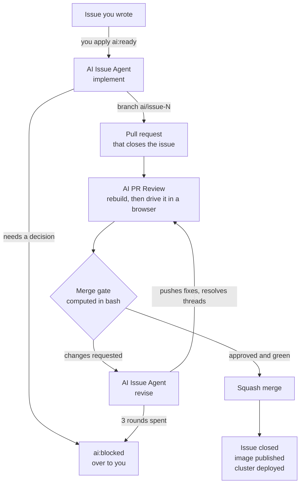

# Proklinator

**A book of curses that you turn, and an agent that does the work.**

The catalogue is presented as a real book: a two-page spread, bookmarks along the fore
edge, and page turns that actually rotate a leaf. Choosing a tier circles it in marker and
drops it onto the order sheet. The interface copy is Russian; everything else here, code
and comments included, is English.

## Features

- Six chapters, each with its own frontispiece and price list
- Automatic composition: whatever does not fit a page is carried to the next one
- Page turns with a three-dimensional leaf rotation and the sound of paper
- Bookmarks on the fore edge: chapters behind you on the left, the ones ahead on the right
- Creased corners hinting that there is another page
- Tier selection circled in marker; the order survives a reload
- An order sheet with the total and the agent launch, ready for Stripe

## Stack

- React 19
- Vite 8
- Tailwind CSS 4 — CSS-first, no config file; theme tokens live in the `@theme` block of `src/index.css`
- ESLint 10 + Prettier 3
- nginx 1.31-alpine runtime image
- Express 5 on Node 24 for the API in `backend/`

## How the book is laid out

Pages do not scroll on a spread. `src/components/MeasureLayer.jsx` renders every content
block once, off-screen, at the exact size of a real page; `src/lib/pagination.js` then packs
those measured heights into pages and pairs the pages into spreads. A chapter always opens
on a left-hand page, so the bookmarks line up with the spread they name.

Two consequences worth knowing before editing:

- The gap between blocks lives in `.page-blocks > * + *` in `src/index.css`. Change it there
  and mirror it in `blockGap()` in `src/App.jsx`, or pagination will misjudge what fits.
- Page typography is sized in `rem` and the root size follows the viewport height, so the
  whole book scales as one. Absolute `px` in page content breaks that.

## Payments

`src/lib/checkout.js` posts the selected line keys to `VITE_CHECKOUT_URL` (default
`/api/checkout/session`), which is expected to create a Stripe Checkout Session and return
its `url`. Prices are never computed on the client: the server resolves them from its own
catalog. Until that endpoint exists, an order is accepted as a request with a reference
number.

## The API

`backend/` is an Express app served at `/api`, deployed beside the site rather than behind
it: Traefik matches `PathPrefix(/api)` on the same host and sends those requests to the API
pod, everything else to nginx. Same origin, so there is no CORS to configure, and the
prefix is not stripped — routes in `backend/src/server.js` are declared with `/api` on them.

`GET /api/health` returns the short SHA of the commit the image was built from, which is
also its tag. That is the quickest way to tell whether a deploy actually landed.

## Development

```bash
npm install
npm run dev
```

The API is a separate package with its own dependencies:

```bash
cd backend
npm install
npm run dev
```

## Before you commit

Run these locally:

```bash
npm run format:check   # Prettier
npm run lint           # ESLint
npm run build          # production build
```

CI runs all three too, but only `build` is blocking — formatting and lint failures are
reported as warnings on the run and do **not** stop a merge or a deployment. Nobody is
policing this, so keep the tree clean yourself.

If `format:check` complains, fix it with:

```bash
npm run format
```

Do not reformat `.github/` — it is listed in `.prettierignore` because `ai-pr-agent.yml`,
`ai-pr-review.yml` and `ai-issue-agent.yml` are generated by `homelab-infra` and
overwritten on every apply. Edit them there, not here.

## CI/CD

Production builds and deployments are fully automated.

Every merge into `main` triggers:

1. Dependency installation
2. Linting and validation
3. Production build
4. Docker image creation — `proklinator-app` (site) and `proklinator-api`, in parallel
5. Image publication to GHCR
6. Deployment start — the cluster is told to roll out the new tag

Both images are tagged with the same 7-character commit SHA and the cluster is bumped only
after both have been pushed, so the site and its API always move together. Adding a third
image means adding it to `homelab-infra`'s `apps` list as well, or its Deployment will
quietly stay on an older tag.

Pull requests run stages 1–3 only; nothing is published or deployed until merge.

`main` is the production branch.

## Handing work to the agents

Three agents run on this repository. The only way to give them work is to open an issue
and label it.



The only two boxes you touch are the first and, if it gets there, `ai:blocked`.

### Creating a task

1. **Open an issue** describing what you want.
2. **Apply the `ai:ready` label.**

That label is the trigger — nothing runs without it. Applying a label needs write access
to the repository, so an outside contributor cannot start a run by asking for one. Every
other label (`type:*`, `p0`–`p2`, `area:*`) is there for humans reading the tracker and
starts nothing.

From there it runs on its own: the implementer claims the issue, branches `ai/issue-<n>`,
writes the change, builds it, drives it in a real browser on desktop and mobile, and opens
a pull request that says `Closes #<n>`. The reviewer then picks that pull request up,
rebuilds it, runs it against a baseline build of `main`, and either merges it — which
closes the issue and deploys — or sends back a numbered list of changes for the
implementer to work through.

You do not need to do anything in between. Watch the issue labels to see where it is:

| Label            | Means                                                                                |
| :--------------- | :----------------------------------------------------------------------------------- |
| `ai:ready`       | Yours to apply. The agent may pick this up.                                          |
| `ai:in-progress` | Claimed, branch exists. This is also the lock — two runs cannot take the same issue. |
| `ai:review`      | Implemented; a pull request is open and under review.                                |
| `ai:blocked`     | Stopped, and it needs you. Read the comment on the issue.                            |

### What the reviewer checks

The reviewer does not read the diff and guess. It builds the change and runs it.

It checks out **the merge result** — what would actually land on `main`, not the branch in
isolation — installs, builds, and then drives the built site with Playwright on three
viewports: desktop at 1440×900, an iPad Air, and an iPhone 13. On each one it records
uncaught exceptions, console errors, failed and 4xx/5xx requests, whether anything
actually rendered, broken images, horizontal overflow, and a full-page screenshot, then
clicks the first control it finds to catch the class of bug that renders fine and explodes
on touch.

At the same time it builds `main` and serves it on a second port. That baseline is the
point: a warning present in both builds is pre-existing and is reported as such, rather
than being blamed on your pull request. Only what the change actually introduced counts
against it.

Screenshots and logs are uploaded to the run as a `pr-<n>-qa` artifact, so you can look at
what it saw.

**The merge decision is computed in bash, not by the model.** Mergeability, the install,
the build, the browser verdict, and whether the head commit moved mid-review are all
evaluated before the model is asked anything. The model can refuse to merge — and often
should — but it cannot merge something those checks rejected. Lint and formatting stay
advisory, exactly as they are in CI: they appear as recommendations and never block.

A merge is a squash, which puts one commit on `main` and starts the publish and deploy
described above.

### Writing an issue an agent can actually build

The agent is not allowed to guess. An issue that leaves a decision open comes straight
back as `ai:blocked`, which costs you a round trip. So:

- **Describe the outcome, not the implementation** — unless the implementation genuinely
  matters, in which case say so and be specific.
- **Give acceptance criteria that can be checked in a browser.** "Works on mobile" is not
  checkable; "the toggle stays aligned with the sound button below 900px" is.
- **Name the files** if you already know which ones are involved. It saves a lot of
  searching and makes the diff smaller.
- **Settle the product and design decisions in the issue.** Wording, visual style,
  behaviour that is a matter of taste — the agent will not choose these for you.
- **Say what is out of scope**, or the change will be larger than you wanted.

### When it stops

`ai:blocked` always comes with a comment saying exactly what is needed. Answer it in the
thread, then remove `ai:blocked` and apply `ai:ready` again to restart.

Review is capped at `AI_MAX_REVIEW_ROUNDS` (currently **3**) round trips. If the reviewer
and the implementer have not converged by then the loop stops and hands the issue back,
because feedback that has not settled in three rounds usually needs a decision rather than
another attempt.

### Pull requests you write yourself

Your own pull requests are reviewed too, by the same reviewer, and merged if they pass —
but only if your GitHub account is on the `PR_REVIEW_ALLOWLIST` repository variable. That
list is matched against the account that opened the pull request; git author name and
email are never consulted, since anyone can set those to anything.

Comment `/ai-review` on a pull request to run the review again.
