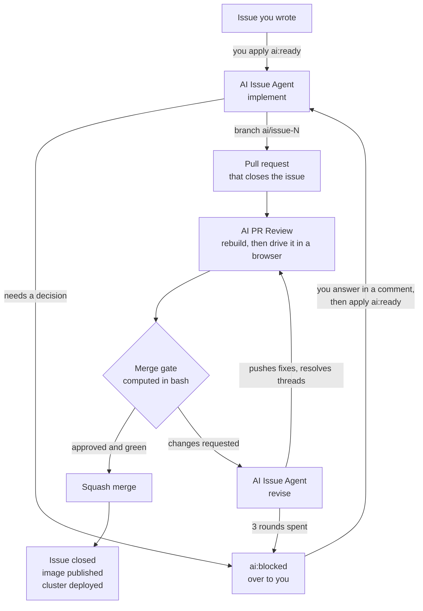

# Proklinator

**A book of curses that you turn, and an agent that does the work.**

The catalogue is presented as a real book: a two-page spread, bookmarks along the fore
edge, and page turns that actually rotate a leaf. Every curse is its own short
multi-page chapter - a legend, an origin, the objects and their symbolism, alleged
accounts, a modern investigation, and a closing choice. Choosing an option circles it
in marker and drops it onto the order sheet, where a one-time Stripe checkout sends it
to the AI. The interface is localised into English and Russian, switchable from the
header; everything else here, code and comments included, is English.

## Features

- Six chapters, each with its own frontispiece; every curse opens on a fresh page and
  runs as a short multi-page chapter of its own
- Automatic composition: whatever does not fit a page is carried to the next one
- Page turns with a three-dimensional leaf rotation and the sound of paper
- Bookmarks on the fore edge: chapters behind you on the left, the ones ahead on the right
- Creased corners hinting that there is another page
- Option selection circled in marker; the cart survives a reload
- An order sheet with the total and a one-time Stripe checkout

## Stack

- React 19
- Vite 8
- Tailwind CSS 4 — CSS-first, no config file; theme tokens live in the `@theme` block of `src/index.css`
- ESLint 10 + Prettier 3
- nginx 1.31-alpine runtime image
- Express 5 on Node 24 for the API in `backend/`

## How the book is laid out

Pages do not scroll on a spread. `src/components/MeasureLayer.jsx` renders every content
block once, off-screen, at the exact size of a real page; `src/lib/pagination.js` then packs
those measured heights into pages and pairs the pages into spreads. A chapter always opens
on a left-hand page, so the bookmarks line up with the spread they name. A curse is one
more level of the same composition: its first section opens on a fresh page, and the
sections after it flow, carrying over when they do not fit, until the closing price list.

Two consequences worth knowing before editing:

- The gap between blocks lives in `.page-blocks > * + *` in `src/index.css`. Change it there
  and mirror it in `blockGap()` in `src/App.jsx`, or pagination will misjudge what fits.
- Page typography is sized in `rem` and the root size follows the viewport height, so the
  whole book scales as one. Absolute `px` in page content breaks that.

## Payments

Prices are backend-owned. `src/lib/useCatalog.js` fetches `GET /api/curses`, and every
price on the price lists, the order sheet and the title page is read from that response —
the frontend data carries only presentation, keyed by the same stable ids. A row whose id
is missing from the catalog (while it loads, or because it vanished) shows an em dash and
cannot be chosen, so the client never invents a price.

The cart lives in `localStorage` as a list of `{ curseId, optionId }` pairs — ids only,
never prices or names. One option per curse, mirroring the book's radio behaviour:
choosing another option of the same curse replaces the first, and clicking the selected
one removes it, so a curse+option can never appear twice.

`src/lib/checkout.js` posts those ids to `VITE_CHECKOUT_URL` (default
`/api/checkout/session`), and the backend validates every pair against its catalog,
resolves the backend-owned names, prices and currency, and creates a one-time Stripe
Checkout Session whose `url` the browser is redirected to. Stripe redirects to
`/success` after a confirmed payment — a theatrical "the curse is being prepared"
sequence of roughly thirty seconds that varies with the selected curse, then the
confirmation page that clears the cart. A cancelled or abandoned checkout lands on
`/cancelled`, the interrupted-rite page: the payment status is stated plainly and the
cart is left untouched so retrying starts from the same order sheet.

## The API

`backend/` is an Express app served at `/api`, deployed beside the site rather than behind
it: Traefik matches `PathPrefix(/api)` on the same host and sends those requests to the API
pod, everything else to nginx. Same origin, so there is no CORS to configure, and the
prefix is not stripped — routes in `backend/src/server.js` are declared with `/api` on them.

`GET /api/health` returns the short SHA of the commit the image was built from, which is
also its tag. That is the quickest way to tell whether a deploy actually landed. It also
reports whether Stripe credentials reached the process — `"stripe": "configured"` or
`"missing"` — never the keys themselves, or any prefix of them.

`GET /api/curses` returns the commerce catalog: a hardcoded in-memory list of curses and
their one-time options, each with a stable id, a backend-owned name, an integer
`unitAmount` in the smallest currency unit and a currency. The catalog is the source of
truth for everything Stripe-facing; the frontend maps its own presentation onto these
ids.

`POST /api/checkout/session` takes `{ items: [{ curseId, optionId }] }` — ids only — and
creates a one-time Stripe Checkout Session. Every item is validated against the catalog
and every line item is named `{Curse Name} — {Option Name}` from backend-owned names.
`success_url` is `/success` on the caller's origin, `cancel_url` is the origin root; both
are built from the request's `Origin` header, the one thing the API pod cannot know about
itself. Without Stripe keys the route answers `503` and the app says payments are
temporarily unavailable.

### Configuration

The API takes its configuration from the environment. Nothing is read from a file and
nothing is baked into the image; a build arg would end up in the layer history of a public
image.

| Variable                 | What it is                                    |
| :----------------------- | :-------------------------------------------- |
| `PORT`                   | Listen port. Defaults to `3000`.              |
| `GIT_SHA`                | Build-time commit, reported by `/api/health`. |
| `STRIPE_SECRET_KEY`      | Stripe secret key. Server-side only, ever.    |
| `STRIPE_PUBLISHABLE_KEY` | Stripe publishable key.                       |

The two Stripe names are identical everywhere and only the **value** changes:

- **In the cluster** they come from the Vault secret `proklinator-secrets` (properties
  `stripe-api-secret-key` and `stripe-api-publishable-key`), pulled in by the External
  Secrets Operator and mounted as environment variables. Live keys.
- **In CI** they are the `STRIPE_TEST_SECRET_KEY` and `STRIPE_TEST_PUBLISHABLE_KEY`
  repository secrets, mapped onto these names in the workflow environment. Test keys, so
  the agents can build and exercise checkout without touching real money.
- **Locally** they are whatever you export.

Nothing in `backend/` branches on which environment it is running in. Code that switches on
`NODE_ENV` to pick a key is code that can pick the wrong one.

Run it locally with test keys:

```bash
cd backend
STRIPE_SECRET_KEY=sk_test_... STRIPE_PUBLISHABLE_KEY=pk_test_... npm run dev
curl -s localhost:3000/api/health
```

## Development

```bash
npm install
npm run dev
```

The API is a separate package with its own dependencies:

```bash
cd backend
npm install
npm run dev
```

The dev server proxies `/api` to the backend, so the app and the API share an
origin exactly like production. The target defaults to `http://localhost:3000`;
point it at a backend elsewhere with a local override:

```bash
echo 'API_PROXY_TARGET=http://localhost:4000' > .env.local
```

`.env.local` is git-ignored; `.env.example` lists the variable.

## Before you commit

Run these locally:

```bash
npm run format:check   # Prettier
npm run lint           # ESLint
npm run build          # production build
```

CI runs all three too, but only `build` is blocking — formatting and lint failures are
reported as warnings on the run and do **not** stop a merge or a deployment. Nobody is
policing this, so keep the tree clean yourself.

If `format:check` complains, fix it with:

```bash
npm run format
```

Do not reformat `.github/` — it is listed in `.prettierignore` because `ai-pr-agent.yml`,
`ai-pr-review.yml` and `ai-issue-agent.yml` are generated by `homelab-infra` and
overwritten on every apply. Edit them there, not here.

## CI/CD

Production builds and deployments are fully automated.

Every merge into `main` triggers:

1. Dependency installation
2. Linting and validation
3. Production build
4. Docker image creation — `proklinator-app` (site) and `proklinator-api`, in parallel
5. Image publication to GHCR
6. Deployment start — the cluster is told to roll out the new tag

Both images are tagged with the same 7-character commit SHA and the cluster is bumped only
after both have been pushed, so the site and its API always move together. Adding a third
image means adding it to `homelab-infra`'s `apps` list as well, or its Deployment will
quietly stay on an older tag.

Pull requests run stages 1–3 only; nothing is published or deployed until merge.

`main` is the production branch.

## Handing work to the agents

Three agents run on this repository. The only way to give them work is to open an issue
and label it.



The only two boxes you touch are the first and, if it gets there, `ai:blocked`. Everything
between the pull request opening and it merging happens without you, including up to three
rounds of review and revision.

### Creating a task

1. **Open an issue** describing what you want.
2. **Apply the `ai:ready` label.**

That label is the trigger — nothing runs without it. Applying a label needs write access
to the repository, so an outside contributor cannot start a run by asking for one. Every
other label (`type:*`, `p0`–`p2`, `area:*`) is there for humans reading the tracker and
starts nothing.

From there it runs on its own: the implementer claims the issue, branches `ai/issue-<n>`,
writes the change, builds it, drives it in a real browser on desktop and mobile, and opens
a pull request that says `Closes #<n>`. The reviewer then picks that pull request up,
rebuilds it, runs it against a baseline build of `main`, and either merges it — which
closes the issue and deploys — or sends back a numbered list of changes for the
implementer to work through.

You do not need to do anything in between. Watch the issue labels to see where it is:

| Label            | Means                                                                                |
| :--------------- | :----------------------------------------------------------------------------------- |
| `ai:ready`       | Yours to apply. The agent may pick this up.                                          |
| `ai:in-progress` | Claimed, branch exists. This is also the lock — two runs cannot take the same issue. |
| `ai:review`      | Implemented; a pull request is open and under review.                                |
| `ai:blocked`     | Stopped, and it needs you. Read the comment on the issue.                            |

### An issue that works

The difference between a one-round issue and a blocked one is almost always whether the
product decisions were already made. Compare:

> **Pay button stays enabled when a cart line has no known price**
>
> `type:bug` `area:order` `p1`
>
> `canPay` in `src/components/LaunchForm.jsx` is `available && totals.count > 0 && state
!== 'sending'`. It ignores `totals.known`, which `App.jsx` computes as "every line has a
> `unitAmount`". A cart entry whose ids are missing from the catalog — stale
> `localStorage`, or an option withdrawn mid-session — therefore leaves the button live
> with a partial amount, and the backend rejects the request with a 400.
>
> **What I want:** the button disables when the total is not fully known.
>
> **Acceptance:**
>
> - With a cart containing one valid line and one whose `curseId` is not in the catalog,
>   the pay button is disabled.
> - The header badge already shows an em dash in that state; it keeps doing so.
> - A cart where every line resolves is unaffected — the button still works.
> - Checked at 1440×900 and on an iPhone 13.
>
> **Files:** `src/components/LaunchForm.jsx`.
> **Out of scope:** letting the user remove the unknown row from the order sheet. That is
> a real gap and it needs a design decision, so it gets its own issue.

That builds in one round. This one does not:

> **Make the prices look better on mobile**

It has no checkable outcome, no decision made about what "better" means, and no
boundary — so it comes back as `ai:blocked` asking which of those you meant, and you
have spent a round trip finding that out.

The rule the agent is held to is that it must not guess. Anything you leave open, it
asks about rather than choosing.

### Scenarios

What actually happens, and what you do, in each case.

**It just works.** Apply `ai:ready`, walk away. Labels go
`ai:ready` → `ai:in-progress` → `ai:review`, a pull request opens, the reviewer merges it,
the issue closes and the cluster deploys. No input from you at any point.

**It stops and asks you something.** The label goes `ai:blocked` and there is a comment on
the issue naming the decision and, usually, the options. Reply in that thread, then apply
`ai:ready` again. **You do not need to remove `ai:blocked` first** — applying `ai:ready`
clears it. The next run reads the whole issue thread and every pull request ever opened
from that branch, including closed ones, before it writes anything, so it continues from
your answer rather than starting over. If a branch already exists it builds on it.

**The reviewer requests changes.** Nothing for you to do. The implementer is dispatched
automatically, pushes fixes, replies on each review thread and resolves it, and the
reviewer runs again. Up to three rounds.

**The reviewer only comments.** The loop stops — a `COMMENT` review never sends work back,
and the reviewer cannot post an `APPROVE` because GitHub does not permit Actions tokens to
approve pull requests, so `COMMENT` is also what its approvals look like. It says so on the
pull request when this happens. To act on the findings anyway, run **Actions → AI Issue
Agent → Run workflow** with `pr=<n>`.

**Three rounds are spent.** The issue goes `ai:blocked` and both the pull request and the
issue get a comment. Answer the open question in either thread, then run **Actions → AI
Issue Agent → Run workflow** with `pr=<n>` and **force** ticked. Without `force` it stops
again — the round count only ever goes up. After a forced round the reviewer still will not
hand back on its own, so each further round is started by you. That is deliberate: each
round is two model runs and two browser passes.

**A run dies halfway.** The issue is never left claimed. It goes `ai:blocked` with a
comment giving the exit status, whether the branch was pushed, what it committed, what was
left uncommitted, and the last 60 lines of output. Restart it the same way: comment, then
`ai:ready`.

Rule of thumb: **before a pull request exists, use the label; once one exists, use
`pr=<n>`.** Revise mode is the path that gets the review threads as structured feedback.
Applying `ai:ready` while a pull request is open is refused, and tells you so.

### What the reviewer checks

The reviewer does not read the diff and guess. It builds the change and runs it.

It checks out **the merge result** — what would actually land on `main`, not the branch in
isolation — installs, builds, and then drives the built site with Playwright on three
viewports: desktop at 1440×900, an iPad Air, and an iPhone 13. On each one it records
uncaught exceptions, console errors, failed and 4xx/5xx requests, whether anything
actually rendered, broken images, horizontal overflow, and a full-page screenshot, then
clicks the first control it finds to catch the class of bug that renders fine and explodes
on touch.

**The API runs while it does this.** The harness starts `backend/` with the Stripe _test_
keys and points the preview server's `/api` proxy at it, so the reviewer exercises real
requests — a checkout session against Stripe's test mode included — rather than reading the
route and guessing. Without it the app's own `/api/health` poll returned 502 on every page
load, which registered as a console error and a bad response and failed the browser QA on
every pull request regardless of its contents.

At the same time it builds `main` and serves it on a second port, with the base branch's
own API beside it, so a change to `backend/` is compared against the backend it replaces
rather than against itself. That baseline is the point, and the merge gate honours it: a
blocking failure that reproduces on `main` is pre-existing and does not count against your
pull request. Only what the change actually introduced does. With no baseline available the
gate falls back to the absolute set.

Screenshots and logs are uploaded to the run as a `pr-<n>-qa` artifact, so you can look at
what it saw.

**The merge decision is computed in bash, not by the model.** Mergeability, the install,
the build, the browser verdict, and whether the head commit moved mid-review are all
evaluated before the model is asked anything. The model can refuse to merge — and often
should — but it cannot merge something those checks rejected. Lint and formatting stay
advisory, exactly as they are in CI: they appear as recommendations and never block.

A merge is a squash, which puts one commit on `main` and starts the publish and deploy
described above.

### Writing an issue an agent can actually build

The agent is not allowed to guess. An issue that leaves a decision open comes straight
back as `ai:blocked`, which costs you a round trip. So:

- **Describe the outcome, not the implementation** — unless the implementation genuinely
  matters, in which case say so and be specific.
- **Give acceptance criteria that can be checked in a browser.** "Works on mobile" is not
  checkable; "the toggle stays aligned with the sound button below 900px" is.
- **Name the files** if you already know which ones are involved. It saves a lot of
  searching and makes the diff smaller.
- **Settle the product and design decisions in the issue.** Wording, visual style,
  behaviour that is a matter of taste — the agent will not choose these for you.
- **Say what is out of scope**, or the change will be larger than you wanted.

### When it stops

`ai:blocked` always comes with a comment saying exactly what is needed. Answer it in the
thread, then apply `ai:ready` to restart — that clears `ai:blocked` on its own, so there is
no need to remove it first and no order to get right.

Review is capped at `AI_MAX_REVIEW_ROUNDS` (currently **3**) round trips. If the reviewer
and the implementer have not converged by then the loop stops and hands the issue back,
because feedback that has not settled in three rounds usually needs a decision rather than
another attempt. To go past it, dispatch **AI Issue Agent** with `pr=<n>` and **force** —
see Scenarios above. The reviewer's own hand-back never passes `force`, so the automatic
loop stays capped whatever you do by hand.

### Pull requests you write yourself

Your own pull requests are reviewed too, by the same reviewer, and merged if they pass —
but only if your GitHub account is on the `PR_REVIEW_ALLOWLIST` repository variable. That
list is matched against the account that opened the pull request; git author name and
email are never consulted, since anyone can set those to anything.

The reviewer never pushes to your branch. It reviews, and it merges or does not; changes
are suggested, never made. Dependency pull requests from bots are a different agent's job
(`ai-pr-agent.yml`), and each refuses the other's pull requests so they cannot collide on
one branch.

Comment `/ai-review` on a pull request to run the review again.

One thing to expect: **its approvals arrive as `COMMENT` reviews, not green checkmarks.**
GitHub does not let an Actions token submit an `APPROVE` event, so the verdict is the first
line of the review body, and the real acceptance is whether it merged.
